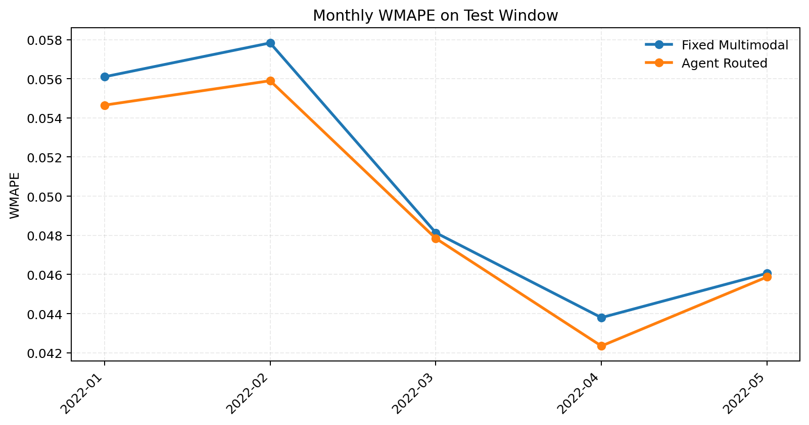
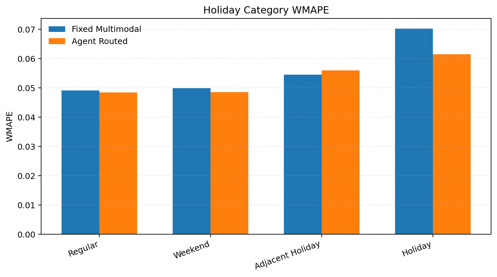
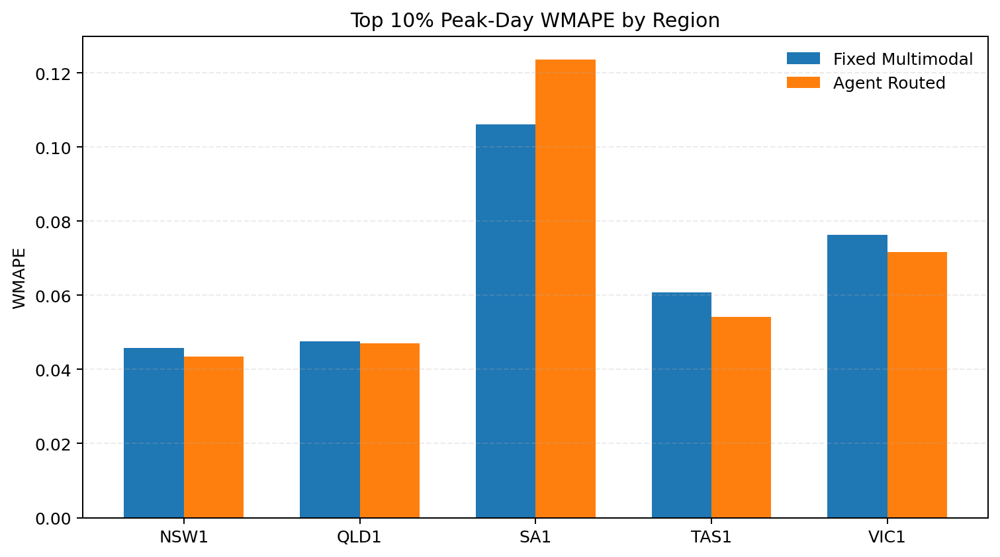

# Australia Five-Region Day-Ahead Power Forecasting Report

## Executive Summary

- Task: five-region joint modeling for `NSW1/QLD1/SA1/TAS1/VIC1`, day-ahead `24h` load forecasting at `30 min` resolution (`48` points/day/region).
- Test window: `2022-01-01` to `2022-05-15`.
- Final routing policy: region-calibrated expert priors blended with rule-based context routing; Ollama remains optional and sits on top of the same safe decision space.
- Acceptance result: `PASS`.
- Overall improvement vs strongest non-Agent baseline: `2.24%` WMAPE.

## Data And Protocol

- Pretrain: `2012-01-01` to `2018-12-31`.
- Multimodal train: `2019-01-01` to `2021-06-30`.
- Validation: `2021-07-01` to `2021-12-31`.
- Test: `2022-01-01` to `2022-05-15`.
- Forecast issue time follows the project protocol: use information available up to `D-1 23:30`, predict `D 00:00` to `D 23:30`.

## Core Results

- `fixed_multimodal WMAPE`: `0.050895`.
- `agent_routed WMAPE`: `0.049754`.
- Peak-window WMAPE improvement: `3.95%`.
- Event-day WMAPE improvement: `2.88%`.

| model | wmape | mae | rmse | smape | improve_vs_fixed_pct |
| --- | --- | --- | --- | --- | --- |
| LagBoostingBaseline | 0.0602 | 251.0788 | 405.9872 | 0.0728 | -18.3518 |
| BaseExpert only | 0.0636 | 264.9110 | 390.3487 | 0.0845 | -24.8719 |
| Base + Weather | 0.0511 | 212.8090 | 309.7334 | 0.0683 | -0.3124 |
| Base + Weather + Event (fixed weights) | 0.0509 | 212.1462 | 309.0691 | 0.0676 | 0.0000 |
| Agent routed | 0.0498 | 207.3908 | 300.5198 | 0.0666 | 2.2416 |

## Visual Analysis

### Monthly Performance

| month | fixed_wmape | agent_wmape | improve_pct |
| --- | --- | --- | --- |
| 2022-01 | 0.0561 | 0.0547 | 2.5818 |
| 2022-02 | 0.0578 | 0.0559 | 3.3397 |
| 2022-03 | 0.0481 | 0.0478 | 0.6019 |
| 2022-04 | 0.0438 | 0.0423 | 3.3112 |
| 2022-05 | 0.0461 | 0.0459 | 0.4088 |

### Holiday And Calendar Categories

| holiday_category | fixed_wmape | agent_wmape | improve_pct |
| --- | --- | --- | --- |
| Regular | 0.0491 | 0.0485 | 1.3474 |
| Weekend | 0.0499 | 0.0485 | 2.6820 |
| Adjacent Holiday | 0.0545 | 0.0560 | -2.7721 |
| Holiday | 0.0702 | 0.0614 | 12.5696 |

### Peak-Day Performance

| region | n_peak_days | fixed_wmape | agent_wmape | improve_pct |
| --- | --- | --- | --- | --- |
| NSW1 | 14 | 0.0457 | 0.0435 | 4.9779 |
| QLD1 | 14 | 0.0476 | 0.0471 | 0.9621 |
| SA1 | 14 | 0.1061 | 0.1237 | -16.5595 |
| TAS1 | 14 | 0.0608 | 0.0542 | 10.7863 |
| VIC1 | 14 | 0.0763 | 0.0717 | 6.0211 |

## Region Breakdown

| region | wmape | mae | rmse | smape |
| --- | --- | --- | --- | --- |
| NSW1 | 0.0372 | 275.2354 | 377.2849 | 0.0367 |
| QLD1 | 0.0402 | 255.5829 | 334.7752 | 0.0406 |
| SA1 | 0.1109 | 141.4793 | 186.7245 | 0.1261 |
| TAS1 | 0.0677 | 75.7197 | 95.7865 | 0.0671 |
| VIC1 | 0.0617 | 288.9366 | 391.2816 | 0.0622 |

## Routing Diagnostics

### Learned Region Priors

| region | prior_base | prior_weather | prior_event |
| --- | --- | --- | --- |
| NSW1 | 0.2800 | 0.7200 | 0.0000 |
| QLD1 | 0.0900 | 0.5600 | 0.3500 |
| SA1 | 0.1400 | 0.8000 | 0.0600 |
| TAS1 | 0.2300 | 0.4500 | 0.3200 |
| VIC1 | 0.2800 | 0.5500 | 0.1700 |

### Realized Average Routing Weights On Test

| region | avg_base_weight | avg_weather_weight | avg_event_weight |
| --- | --- | --- | --- |
| NSW1 | 0.2892 | 0.6862 | 0.0246 |
| QLD1 | 0.1299 | 0.5195 | 0.3506 |
| SA1 | 0.1717 | 0.7595 | 0.0688 |
| TAS1 | 0.2369 | 0.4348 | 0.3283 |
| VIC1 | 0.2735 | 0.5325 | 0.1939 |

### Risk Distribution

| risk_level | count | share_pct |
| --- | --- | --- |
| low | 532 | 78.81 |
| medium | 114 | 16.89 |
| high | 29 | 4.30 |

## Acceptance Check

- Overall WMAPE improvement: `2.24%`.
- Peak subset improvement: `3.95%`.
- Event-day subset improvement: `2.88%`.
- Decision: `PASS` against the project threshold (`>=2%` overall or `>=5%` on peak/event subsets with no meaningful overall regression).

## Artifacts

- Summary JSON: `artifacts/reports/backtest_summary.json`
- Ablation CSV: `artifacts/reports/ablation_table.csv`
- Routing summary CSV: `artifacts/reports/routing_summary.csv`
- Monthly breakdown CSV: `artifacts/reports/monthly_breakdown.csv`
- Holiday breakdown CSV: `artifacts/reports/holiday_breakdown.csv`
- Peak breakdown CSV: `artifacts/reports/peak_breakdown.csv`
- Region priors JSON: `artifacts/models/region_weight_priors.json`

## Learned Router Diagnostics

- Learned-router validation rule WMAPE: `0.051048`.
- Learned-router validation blended WMAPE: `0.050644`.
- Learned-router blend alpha after safeguard: `0.60`.
